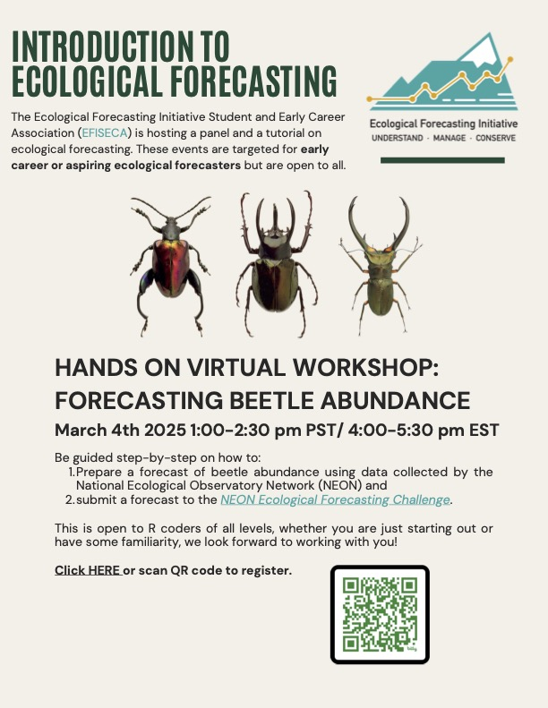

# Introduction to Ecological Forecasting: Hands on workshop for Forecasting NEON Beetle abundance

This repo contains the files for following along with a workshop on forecasting beetle abundance for the [NEON forecasting challenge](https://projects.ecoforecast.org/neon4cast-docs/Beetles.html). The code is in R, and there are two options for following along: 

1. [Download the R script for using Rstudio on your personal computer](#Rstudio)
2. [Use the .ipynb files for opening in Jupyter with an R kernel](##Jupyter)
3. [Open the .ipynb file with Google Colab](#Google-colab)

There are also two options for following the tutorial - one file for live coding (NEON_forecast_challenge_beetle_tutorial_LiveCode), which is mostly blank so you can type along, and one file for running code that is pre-written (NEON_forecast_challenge_beetle_tutorial_fullScript). We hope these options make the workshop accessible for those with little to no prior coding experience! 

Whichever environment you work in, be sure to open the file before the workshop and install and load the packages  we will need in the tutorial: 

```
## ----install packages----------------------------------------------------------------
# tidyverse package for tidying, wrangling, visualizing data 
if(!require("tidyverse")) install.packages("tidyverse") 
# lubridate, which is part of tidyverse, makes handling dates easier 
if(!require("lubridate")) install.packages("lubridate") 
# tsibble package for tidy temporal data 
install.packages('tsibble')
# fable package for forecasting models for tidy time series 
install.packages('fable')
# neon4cast used for formmating with function efi_format(), for submitting forecast 
remotes::install_github("eco4cast/neon4cast")
# score4cast is for getting score CRPS 
devtools::install_github("eco4cast/score4cast")

## ----load packages----------------------------------------------------------------
library(tidyverse)
library(tsibble)
library(fable)
library(fabletools)
library(neon4cast)
library(score4cast)
```

## Rstudio 

- If you already have R and Rstudio installed on your computer, then all you need to do is download the file [NEON_forecast_challenge_beetle_tutorial_LiveCode.R](https://github.com/rachtorr/efiseca_beetles_tutorial/blob/main/NEON_forecast_challenge_beetle_tutorial_LiveCode.R) and open in Rstudio. 

- If you don't have R and Rstudio yet but want to use it, you can follow these steps to download and set it up: [Installing R and Rstudio](https://rstudio-education.github.io/hopr/starting.html)

## Jupyter 

- If you use a Jupyter Hub for working in R, you can download the [.ipynb file](https://github.com/rachtorr/efiseca_beetles_tutorial/blob/main/NEON_forecast_challenge_beetle_tutorial_LiveCode_R.ipynb) and upload it to your hub to work with it there 

## Google Colab

- If you are not familiar with Rstudio or Jupyter, you can follow along in Google Colab using [this link](https://colab.research.google.com/drive/1DJcHUppFpZTGjL4s392xe6Gg1nbhYlpb?usp=sharing). All you need for this is a Gmail log-in. To save your changes, you will need to make a copy and save it to your Google drive. 

- Read more about Google Colab [here](https://research.google.com/colaboratory/faq.html). 

# Acknowledgements 

This tutorial was used previously in an ESA workshop led by Eric Sokol, and was created for NEON (National Ecological Observatory Network). Data Tutorial: [Forecasting Beetle Richness and Abundance.](https://www.neonscience.org/resources/learning-hub/tutorials/neon-beetle-forecasting.)
It is based off of tutorials created by Freya Olsson for the NEON Forecasting Challenge Workshop and examples form Carl Boettiger for the Beetles Communities theme documentation.  

This workshop was planned and hosted by the [Ecological Forecasting Initiative Student and Early Career Association](https://ecoforecast.org/student-and-early-career-association/).
